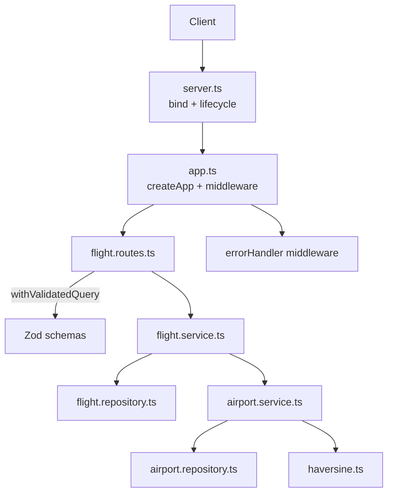

# Flight Search API - Technical Challenge

Fix a ranking bug, add search filters, and calculate real distances between airports.

## Quick start

```bash
npm install
npm run dev    # http://localhost:3000
npm test
```

```bash
curl "http://localhost:3000/api/flights/search"
curl "http://localhost:3000/api/flights/search?preferredAirline=AA"
curl "http://localhost:3000/api/flights/search?maxDuration=5"
```

Once the server is running, browse the interactive API docs at `http://localhost:3000/docs`. More details in the [API documentation](#api-documentation) section.

## Core implementation

### Task A - Fix ranking

The bug was in `scoreAndSortFlights`: preferred airline flights were scored correctly but sorted wrong.

- Score: `duration × 0.9` for preferred carrier, else `duration × 1.0`
- Sort: Ascending by score (lower is better)

I separated scoring and sorting into `scoreFlights` and `sortByScore` to follow single responsibility and avoid mutating the input. #1, #3

### Task B - Filters

I added optional query parameters: `maxDuration`, `minDepartureTime`, and `maxDepartureTime`. The final implementation in #33 uses a Zod schema to treat them as optional, coerce types, and return clean validation errors. I also added a check in #58 to guarantee that `maxDepartureTime` is after `minDepartureTime`.

### Task C - Real distance

For the airport data, I wrote a script (`npm run fetch-airports`) to download the OpenFlights dataset, validate rows with Zod, and build a JSON map for O(1) lookup. Since the dataset hasn't changed in years, I committed the pre-processed `airports.json` instead of fetching it on every startup. #12

For the distance calculation, I used TDD to implement `haversineDistanceMiles` and calibrated it against [this online calculator](https://www.airmilescalculator.com/). The function is pure math; validation happens at the boundaries. If an airport code is missing or unknown, `getDistanceBetweenAirports` returns `null` instead of throwing so the flight still shows up in results. #17, #20

I applied this "Zod at the boundaries" pattern everywhere: query parameters, upstream flights feed, startup environment variables, and airport data. If anything is invalid at the edge, it fails fast and returns 400 with `application/problem+json`. #33, #35

### Testing

- **Unit tests:** Cover pure logic (haversine formula, filtering/sorting, and airport distance mapping).
- **HTTP tests (supertest):** Verify routes, validation rules, error handling, and response schemas.

Airport service tests use the real `airports.json` but mock the haversine formula. Flight service tests mock the airport service to keep tests isolated. #14, #49, #58

## Assumptions

- Only airports with valid IATA codes are kept, as the API only handles commercial flights.
- Committing the pre-processed JSON is enough for this challenge. In production, I would store it in a database and cache it in Redis.
- Unknown airport codes return `distance: null` rather than throwing an error so the flight remains visible.

## Workflow

I used a [GitHub Projects kanban](https://github.com/users/fariassdev/projects/3/views/2) to stay organized. I focused on getting working software first, keeping PRs and commits atomic. Once the core challenge was complete (#1 to #20), I shifted to production-ready improvements (error handling, logging, environment safety, etc.), layering them in one clean PR at a time (#23 to #58).

## Architecture and project structure

I modularized the monolithic `server.ts` in #16. Express setup is decoupled from port binding: `createApp()` builds and wires the application, while `server.ts` handles the process lifecycle (graceful shutdown, signal handling). This split (done in #31) allows us to run HTTP tests without opening sockets.

| Layer      | Files             | Responsibility                                           |
| ---------- | ----------------- | -------------------------------------------------------- |
| Server     | `server.ts`       | Port binding, process lifecycle, graceful shutdown       |
| App        | `app.ts`          | Express app initialization, middleware wiring            |
| Routes     | `*.routes.ts`     | Endpoint definitions, query validation, typing responses |
| Service    | `*.service.ts`    | Business logic (filter/score/sort, distance math)        |
| Repository | `*.repository.ts` | Data access (flight feed fetch, airport lookups)         |
| Schema     | `*.schema.ts`     | Zod schemas for runtime validation and inferred types    |
| Shared     | `shared/**`       | Custom errors, middleware, logger, haversine formula     |
| Config     | `config/env.ts`   | Validated, typed environment configuration               |

<details>
<summary><b>View architecture diagram</b></summary>



</details>

## Making it production-ready

These are the things I'd want in a real service. Each one is an atomic PR, easy to review, easy to revert.

<details>
<summary><b>Error handling middleware</b> (#35, improved in #37)</summary>

A single error-handling middleware registered last. Anywhere in the request path I just `throw` a typed `HttpError` subclass (e.g. `ValidationError`, `InternalServerError`); the middleware turns it into an RFC 7807 `application/problem+json` response, logs 5xx as `error` and 4xx as `warn`, and collapses anything unexpected into a generic 500 without leaking internals. This is the right place to handle errors because formatting lives in exactly one spot and the handlers stay focused on the happy path with one consistent error contract.

In #35 I moved from handling errors inline in each handler (with `res.status().json()`) to forwarding them via `next(new ValidationError(...))` so the centralized middleware takes care of formatting. The Express 5 upgrade in #37 simplified this further: I could just `throw` instead of calling `next(err)`, and drop the `next` parameter from the handlers entirely.

</details>

<details>
<summary><b>Type-safe query validation</b> (#33)</summary>

I validate query params with a small handler wrapper, `withValidatedQuery(schema, handler)`, instead of a plain middleware. It was the best option I found that is, at the same time:

- **Type safe**: the `query` argument the handler receives is fully inferred from the Zod schema (`z.infer`), so I work with parsed, typed values, not `string | string[]`.
- **Semantic and readable**: validation sits right next to the route it guards.
- **Response-safe**: I can type the route's `Response<T>`, so returning a malformed response is a compile-time error.

The alternatives I considered were mutating `req.query` from a middleware or extending the Express `Request` interface with TypeScript module augmentation. Both were weaker on type safety because I had to type the parsed query as `unknown` or `Record<string, unknown>` and couldn't get full type inference at the route layer.

</details>

<details>
<summary><b>Centralized, validated config</b> (#42)</summary>

All configuration is read once at startup into a single typed `envConfig` object, validated by Zod. Bad config fails fast with readable field errors instead of blowing up at runtime. It loads `.env` then `.env.<NODE_ENV>` using Node's native `loadEnvFile()`, so no `dotenv` dependency needed. This only became possible after the Node upgrade in #40.

</details>

<details>
<summary><b>Express hardening</b> (#45)</summary>

Minimal but production-minded HTTP defaults: `helmet`, env-driven CORS, bounded body parsers, and graceful shutdown with a forced-exit fallback.

</details>

<details>
<summary><b>Structured logging</b> (#51)</summary>

Centralized logging with Pino + `pino-http`. One logger module, a per-request logger (`req.log`), env-aware levels (silent in tests, pretty in dev, JSON in prod). No scattered `console.log`.

</details>

<details>
<summary><b>API Documentation</b> (#53, #56)</summary>

Refer to the [API documentation](#api-documentation) section below.

</details>

<details>
<summary><b>Developer experience and code quality</b> (#23, #24, #27, #28)</summary>

ESLint, Prettier, and Husky + lint-staged run lint/format on commit, with commitlint enforcing conventional commits. `.editorconfig` and `.gitattributes` ensure consistent formatting and line endings across editors and OS. This keeps diffs clean, history semantic, and catches problems before they land.

</details>

<details>
<summary><b>Reproducible environment</b> (#40, #47)</summary>

Pinning the runtime and dependencies matters so the project behaves the same on every machine and in CI. I pin Node with `.nvmrc` + `engines` + `engine-strict=true` (npm refuses the wrong Node), and pin exact dependency versions with `save-exact=true` so new installs don't drift into caret ranges. The lockfile is committed too.

</details>

## API Documentation

The OpenAPI 3.0 spec is generated directly from the Zod schemas used for validation (#53), preventing documentation drift. It is served at `/openapi.json` and rendered as a Scalar docs UI at `/docs` (#56). Both endpoints are disabled in production to keep the API private and reduce attack surface.

## Future work

For a real production project, there are several draft issues from my [backlog](https://github.com/users/fariassdev/projects/3/views/2) that would be desirable to set up next:

- **CI/CD pipeline**: Set up GitHub Actions to run tests, linting, and formatting checks automatically on every PR.
- **Dockerization**: Add a `Dockerfile` to containerize the application.
- **CD and deployment**: Configure a deployment pipeline to release the service.
- **Import aliases**: Configure TypeScript path mappings (like `@/*`) to avoid long relative imports.
- **Package manager**: Switch to `pnpm` for faster installs and better security.
- **Jest coverage threshold**: Enforce a minimum test coverage percentage in Jest.

### Discarded issues

I marked these backlog issues as `WONTFIX` as they are not needed for this challenge:

- Add pagination (#38): The upstream feed is a single JSON blob, so pagination wouldn't save fetch or memory work.
- Health and readiness endpoints (#44): There is no live deployment for this challenge.
- Ensure `airports.json` is updated with OpenFlights `airports.dat` (#11): Unnecessary overhead for this challenge.

## How I used AI

The core use was for issue and PR descriptions: Cursor or GitHub Copilot's "Summarize" button gave me a draft, I tweaked it, linked the issue, and submitted. That saved me time on the most repetitive writing.

For research I used Perplexity as my main search engine. It was really useful when I needed to compare approaches, for example when choosing how to generate the OpenAPI spec. I looked into [tsoa](https://github.com/lukeautry/tsoa), [swagger-jsdoc](https://github.com/Surnet/swagger-jsdoc), [zod-to-openapi](https://github.com/samchungy/zod-openapi) and [@asteasolutions/zod-to-openapi](https://github.com/asteasolutions/zod-to-openapi), gathered the trade-offs through Perplexity, and made an informed decision based on my own criteria after having all the context.

Beyond that, I used it as a copilot assistant, not as the main driver. For most PRs the inline IDE autocomplete was enough to complete the implementation quickly by myself. In more complex parts, like the query validation middleware, I also used Perplexity and Cursor to help me reach the approach I liked the most, but without delegating the full implementation to them. For easier tasks to automate, like writing tests once I had the testing strategy clear, I let Cursor write some of them and then reviewed. Finally, I also used AI to help me structure, review, and put the final touches on this README.
