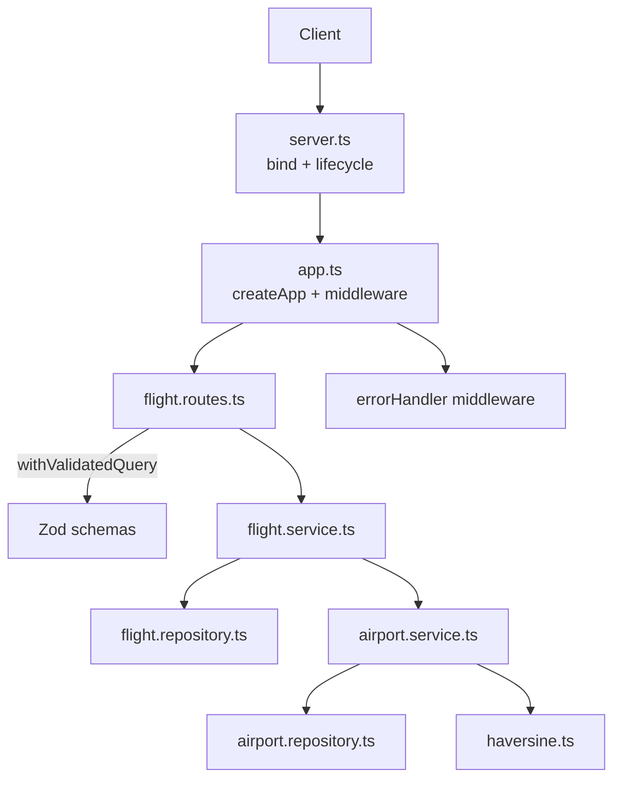

# Flight Search API - Technical Challenge

Fix a ranking bug, add search filters, and calculate real distances between airports.

## Quick start

```bash
npm install
npm run dev    # http://localhost:3000
npm test
```

```bash
curl "http://localhost:3000/api/flights/search"
curl "http://localhost:3000/api/flights/search?preferredAirline=AA"
curl "http://localhost:3000/api/flights/search?maxDuration=5"
```

Airport data is already committed. To regenerate: `npm run fetch-airports`.

## Core implementation

### Task A - Fix ranking

The bug was in `scoreAndSortFlights`: preferred airline flights were scored right but sorted wrong.

- Score = `duration × 0.9` when carrier matches `preferredAirline`, else `duration × 1.0`
- Sort by score ascending (lower is better)

I also split scoring and sorting into `scoreFlights` and `sortByScore`, one job each, and sorting no longer mutates the input. #1, #3, #40 (changed to modern toSorted syntax later)

### Task B - Filters

Optional query params: `maxDuration`, `minDepartureTime`, `maxDepartureTime`. Applied before scoring; they work together and with `preferredAirline`. Requirements in #2, first implementation in #5.

In #5 I added a quick `maxDuration` check, but it always ran `Number(maxDuration)`, so a request without `maxDuration` got a 400. The final fix is in #33: `FlightSearchQuerySchema` treats all filter params as optional, coerces types, and returns proper validation errors only when a param is actually sent. I also added a validation in #58 to ensure that the `maxDepartureTime` query parameter is after `minDepartureTime`.

### Task C - Real distance

For the airport data, I wrote a script (`npm run fetch-airports`) to download OpenFlights `airports.dat`, parse the CSV, validate the records with Zod, and build a JSON map keyed by IATA code for O(1) lookup. Since the OpenFlights file hasn't changed in years, I committed the pre-processed `airports.json` instead of fetching it on every server start. At runtime, `findByIata` just reads that file once. Only airports with a valid IATA code are kept (see [assumptions](#assumptions) below). More context in #12.

To calculate the distance, I used TDD. I wrote tests first using [airmilescalculator.com](https://www.airmilescalculator.com/) to calibrate the expected distances, implemented `haversineDistanceMiles` to pass them, and then refactored. The function itself is pure math, with no coordinate validation inside; that happens at the edges. If an airport code is missing or unknown, `getDistanceBetweenAirports` returns `null` instead of throwing, so the flight still shows up in results. #17, #20

I followed this "Zod at the edges" approach for the rest of the project: search query params, upstream flight JSON, airport fetch script output, the committed `airports.json` on load, and env config at startup. Any invalid input fails fast and returns a 400 with `application/problem+json`. #33, #35

### Testing

- Unit tests for pure logic: haversine, filter/score/sort, airport distance
- HTTP tests with supertest: query params, response shape, validation errors

Haversine correctness is tested on its own. Airport service tests mock only the haversine function and use the real `airports.json` for lookups. Flight service tests mock the airport service to avoid using the real `airports.json` for lookups and focus on flight service logic.

Relevant PRs: #14, #49, #58

## Assumptions

- Only airports with valid IATA codes, since the API is for commercial flights and the flight feed uses IATA codes.
- Airport data doesn't change much. Committing the pre-processed JSON is fine for this challenge. In production I'd store it in a database and cache in Redis.
- Unknown airport codes return `distance: null`, not an error. The flight still shows up in results.

## Workflow

I used a [GitHub Projects kanban](https://github.com/users/fariassdev/projects/3/views/2) to stay organized. My approach was to focus on getting working software first, keeping PRs and commits atomic. Once the core challenge tasks were done (#1 to #20), I shifted focus to production-ready standards (error handling, logging, reproducible environments, and configuration safety), introducing them one clean PR at a time (#23 to #58).

### How I used AI

The core use was for issue and PR descriptions: Cursor or GitHub Copilot's "Summarize" button gave me a draft, I tweaked it, linked the issue, and submitted. That saved me time on the most repetitive writing.

For research I used Perplexity as my main search engine. It was really useful when I needed to compare approaches, for example when choosing how to generate the OpenAPI spec. I looked into [tsoa](https://github.com/lukeautry/tsoa), [swagger-jsdoc](https://github.com/Surnet/swagger-jsdoc), [zod-to-openapi](https://github.com/samchungy/zod-openapi) and [@asteasolutions/zod-to-openapi](https://github.com/asteasolutions/zod-to-openapi), gathered the trade-offs through Perplexity, and made an informed decision based on my own criteria after having all the context.

Beyond that, I used it as a copilot assistant, not as the main driver. For most PRs the inline IDE autocomplete was enough to complete the implementation quickly by myself. In more complex parts, like the query validation middleware, I also used Perplexity and Cursor to help me reach the approach I liked the most, but without delegating the full implementation to them. For easier tasks to automate, like writing tests once I had the testing strategy clear, I let Cursor write some of them and then reviewed.

## Architecture and project structure

I moved away from the original monolithic `server.ts` into a modular layout in #16 and kept that shape from there on. Each file has a single responsibility, and the Express app creation is decoupled from the server binding: `createApp()` builds and wires the app, `server.ts` only binds the port and owns the process lifecycle (graceful shutdown, signals). That split (done in #31) is what makes the HTTP tests possible without ever opening a socket.

| Layer      | Files             | Responsibility                                         |
| ---------- | ----------------- | ------------------------------------------------------ |
| Server     | `server.ts`       | Bind port, lifecycle (graceful shutdown, signals)      |
| App        | `app.ts`          | Build Express app, wire middleware and routes          |
| Routes     | `*.routes.ts`     | Define endpoints, validate query, type the response    |
| Service    | `*.service.ts`    | Business logic: filter/score/sort, distance            |
| Repository | `*.repository.ts` | Data access: fetch flights, airport lookup             |
| Schema     | `*.schema.ts`     | Zod schemas = validation + inferred types at the edges |
| Shared     | `shared/**`       | Errors, middleware, logger, haversine                  |
| Config     | `config/env.ts`   | Typed env, validated once at startup                   |



The same modular shape pays off in the **tests**: pure logic (haversine, filter/score/sort, distance) is unit-tested in isolation, and the wired app is tested end-to-end with `supertest`, no running server needed. See the [Testing](#testing) section above.

## Making it production-ready

These are the things I'd want in a real service. Each one is an atomic PR, easy to review, easy to revert.

<details>
<summary><b>Error handling middleware</b> (#35, improved in #37)</summary>

A single error-handling middleware registered last. Anywhere in the request path I just `throw` a typed `HttpError` subclass (e.g. `ValidationError`, `InternalServerError`); the middleware turns it into an RFC 7807 `application/problem+json` response, logs 5xx as `error` and 4xx as `warn`, and collapses anything unexpected into a generic 500 without leaking internals. This is the right place to handle errors because formatting lives in exactly one spot and the handlers stay focused on the happy path with one consistent error contract.

In #35 I moved from handling errors inline in each handler (with `res.status().json()`) to forwarding them via `next(new ValidationError(...))` so the centralized middleware takes care of formatting. The Express 5 upgrade in #37 simplified this further: I could just `throw` instead of calling `next(err)`, and drop the `next` parameter from the handlers entirely.

</details>

<details>
<summary><b>Type-safe query validation</b> (#33)</summary>

I validate query params with a small handler wrapper, `withValidatedQuery(schema, handler)`, instead of a plain middleware. It was the best option I found that is, at the same time:

- **Type safe**: the `query` argument the handler receives is fully inferred from the Zod schema (`z.infer`), so I work with parsed, typed values, not `string | string[]`.
- **Semantic and readable**: validation sits right next to the route it guards.
- **Response-safe**: I can type the route's `Response<T>`, so returning a malformed response is a compile-time error.

The alternatives I considered were mutating `req.query` from a middleware or extending the Express `Request` interface with TypeScript module augmentation. Both were weaker on type safety because I had to type the parsed query as `unknown` or `Record<string, unknown>` and couldn't get full type inference at the route layer.

</details>

<details>
<summary><b>Centralized, validated config</b> (#42)</summary>

All configuration is read once at startup into a single typed `envConfig` object, validated by Zod. Bad config fails fast with readable field errors instead of blowing up at runtime. It loads `.env` then `.env.<NODE_ENV>` using Node's native `loadEnvFile()`, so no `dotenv` dependency needed. This only became possible after the Node upgrade in #40.

</details>

<details>
<summary><b>Express hardening</b> (#45)</summary>

Minimal but production-minded HTTP defaults: `helmet`, env-driven CORS, bounded body parsers, and graceful shutdown with a forced-exit fallback.

</details>

<details>
<summary><b>Structured logging</b> (#51)</summary>

Centralized logging with Pino + `pino-http`. One logger module, a per-request logger (`req.log`), env-aware levels (silent in tests, pretty in dev, JSON in prod). No scattered `console.log`.

</details>

<details>
<summary><b>Developer experience and code quality</b> (#23, #24, #27, #28)</summary>

ESLint, Prettier, and Husky + lint-staged run lint/format on commit, with commitlint enforcing conventional commits. `.editorconfig` and `.gitattributes` ensure consistent formatting and line endings across editors and OS. This keeps diffs clean, history semantic, and catches problems before they land.

</details>

<details>
<summary><b>Reproducible environment</b> (#40, #47)</summary>

Pinning the runtime and dependencies matters so the project behaves the same on every machine and in CI. I pin Node with `.nvmrc` + `engines` + `engine-strict=true` (npm refuses the wrong Node), and pin exact dependency versions with `save-exact=true` so new installs don't drift into caret ranges. The lockfile is committed too.

</details>
