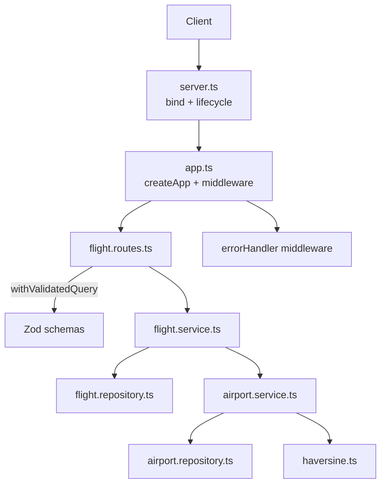

# Flight Search API - Technical Challenge

Fix a ranking bug, add search filters, and calculate real distances between airports.

## Quick start

### Local Development

```bash
npm install
npm run dev    # http://localhost:3000
npm test
```

### Docker Development

Alternatively, you can run the development environment in Docker using:

```bash
npm run docker:up    # http://localhost:3000
```

### Usage

```bash
curl "http://localhost:3000/api/flights/search"
curl "http://localhost:3000/api/flights/search?preferredAirline=AA"
curl "http://localhost:3000/api/flights/search?maxDuration=5"
```

Once the server is running, browse the interactive API docs at `http://localhost:3000/docs`. More details in the [API documentation](#api-documentation) section.

## Core implementation

### Task A - Fix ranking

The bug was in `scoreAndSortFlights`: preferred airline flights were scored correctly but sorted wrong.

- Score: `duration × 0.9` for preferred carrier, else `duration × 1.0`
- Sort: Ascending by score (lower is better)

I separated scoring and sorting into `scoreFlights` and `sortByScore` to follow single responsibility and avoid mutating the input. [#1](https://github.com/fariassdev/flight-search-backend-challenge/pull/1), [#3](https://github.com/fariassdev/flight-search-backend-challenge/pull/3)

### Task B - Filters

I added optional query parameters: `maxDuration`, `minDepartureTime`, and `maxDepartureTime`. The final implementation in [#33](https://github.com/fariassdev/flight-search-backend-challenge/pull/33) uses a Zod schema to treat them as optional, coerce types, and return clean validation errors. I also added a check in [#58](https://github.com/fariassdev/flight-search-backend-challenge/pull/58) to guarantee that `maxDepartureTime` is after `minDepartureTime`.

### Task C - Real distance

For the airport data, I wrote a script (`npm run fetch-airports`) to download the OpenFlights dataset, validate rows with Zod, and build a JSON map for O(1) lookup. Since the dataset hasn't changed in years, I committed the pre-processed `airports.json` instead of fetching it on every startup. [#12](https://github.com/fariassdev/flight-search-backend-challenge/pull/12)

For the distance calculation, I used TDD to implement `haversineDistanceMiles` and calibrated it against [this online calculator](https://www.airmilescalculator.com/). The function is pure math; validation happens at the boundaries. If an airport code is missing or unknown, `getDistanceBetweenAirports` returns `null` instead of throwing so the flight still shows up in results. [#17](https://github.com/fariassdev/flight-search-backend-challenge/pull/17), [#20](https://github.com/fariassdev/flight-search-backend-challenge/pull/20)

I applied this "Zod at the boundaries" pattern everywhere: query parameters, upstream flights feed, startup environment variables, and airport data. If anything is invalid at the edge, it fails fast and returns 400 with `application/problem+json`. [#33](https://github.com/fariassdev/flight-search-backend-challenge/pull/33), [#35](https://github.com/fariassdev/flight-search-backend-challenge/pull/35)

### Testing

- **Unit tests:** Cover pure logic (haversine formula, filtering/sorting, and airport distance mapping).
- **HTTP tests (supertest):** Verify routes, validation rules, error handling, and response schemas.

Airport service tests use the real `airports.json` but mock the haversine formula. Flight service tests mock the airport service to keep tests isolated. [#14](https://github.com/fariassdev/flight-search-backend-challenge/pull/14), [#49](https://github.com/fariassdev/flight-search-backend-challenge/pull/49), [#58](https://github.com/fariassdev/flight-search-backend-challenge/pull/58)

## Assumptions

- Only airports with valid IATA codes are kept, as the API only handles commercial flights.
- Committing the pre-processed JSON is enough for this challenge. In production, I would store it in a database and cache it in Redis.
- Unknown airport codes return `distance: null` rather than throwing an error so the flight remains visible.

## Workflow

I used a [GitHub Projects kanban](https://github.com/users/fariassdev/projects/3/views/2) to stay organized. I focused on getting working software first, keeping PRs and commits atomic. Once the core challenge was complete ([#1](https://github.com/fariassdev/flight-search-backend-challenge/pull/1) to [#20](https://github.com/fariassdev/flight-search-backend-challenge/pull/20)), I shifted to production-ready improvements (error handling, logging, environment safety, etc.), layering them in one clean PR at a time ([#23](https://github.com/fariassdev/flight-search-backend-challenge/pull/23) to [#58](https://github.com/fariassdev/flight-search-backend-challenge/pull/58)).

## Architecture and project structure

I modularized the monolithic `server.ts` in [#16](https://github.com/fariassdev/flight-search-backend-challenge/pull/16). Express setup is decoupled from port binding: `createApp()` builds and wires the application, while `server.ts` handles the process lifecycle (graceful shutdown, signal handling). This split (done in [#31](https://github.com/fariassdev/flight-search-backend-challenge/pull/31)) allows us to run HTTP tests without opening sockets.

| Layer      | Files             | Responsibility                                           |
| ---------- | ----------------- | -------------------------------------------------------- |
| Server     | `server.ts`       | Port binding, process lifecycle, graceful shutdown       |
| App        | `app.ts`          | Express app initialization, middleware wiring            |
| Routes     | `*.routes.ts`     | Endpoint definitions, query validation, typing responses |
| Service    | `*.service.ts`    | Business logic (filter/score/sort, distance math)        |
| Repository | `*.repository.ts` | Data access (flight feed fetch, airport lookups)         |
| Schema     | `*.schema.ts`     | Zod schemas for runtime validation and inferred types    |
| Shared     | `shared/**`       | Custom errors, middleware, logger, haversine formula     |
| Config     | `config/env.ts`   | Validated, typed environment configuration               |

<details>
<summary><b>View architecture diagram</b></summary>



</details>

## Making it production-ready

These additions reflect the standards I expect in a real production service. Each was introduced in its own atomic PR.

<details>
<summary><b>Error handling middleware</b> (<a href="https://github.com/fariassdev/flight-search-backend-challenge/pull/35">#35</a>, improved in <a href="https://github.com/fariassdev/flight-search-backend-challenge/pull/37">#37</a>)</summary>

A centralized middleware maps any thrown `HttpError` (e.g., `ValidationError`, `InternalServerError`) into an RFC 7807 `application/problem+json` response, logs error levels accordingly, and hides internal details for unhandled 500s.

In [#35](https://github.com/fariassdev/flight-search-backend-challenge/pull/35) I used `next(new ValidationError(...))` to forward errors to the middleware. Upgrading to Express 5 in [#37](https://github.com/fariassdev/flight-search-backend-challenge/pull/37) simplified this, allowing me to directly `throw` errors from async handlers and omit the `next` callback entirely.

</details>

<details>
<summary><b>Type-safe query validation</b> (<a href="https://github.com/fariassdev/flight-search-backend-challenge/pull/33">#33</a>)</summary>

I validate query params using `withValidatedQuery(schema, handler)`. This wrapper:

- Infers the query types from the Zod schema (`z.infer`), avoiding manual casts.
- Keeps validation right next to the route it guards.
- Integrates with Express response typing to guarantee compile-time response safety.

Alternative approaches like mutating `req.query` in middleware or using TypeScript module augmentation were rejected because they required typing the parsed query as `unknown`, losing compile-time type safety.

</details>

<details>
<summary><b>Centralized, validated config</b> (<a href="https://github.com/fariassdev/flight-search-backend-challenge/pull/42">#42</a>)</summary>

All configuration is read once at startup into a Zod-validated `envConfig` object. Bad configurations fail fast with readable field errors. It loads `.env` then `.env.<NODE_ENV>` using Node's native `loadEnvFile()`, eliminating the `dotenv` dependency (possible after the Node upgrade in [#40](https://github.com/fariassdev/flight-search-backend-challenge/pull/40)).

</details>

<details>
<summary><b>Express hardening</b> (<a href="https://github.com/fariassdev/flight-search-backend-challenge/pull/45">#45</a>)</summary>

Secured the app using `helmet`, environment-driven CORS, bounded body parsers, and a clean graceful shutdown sequence.

</details>

<details>
<summary><b>Structured logging</b> (<a href="https://github.com/fariassdev/flight-search-backend-challenge/pull/51">#51</a>)</summary>

Centralized logging using Pino + `pino-http`. Employs a single logger module, per-request context logging (`req.log`), and environment-aware formatting (pretty-print in development, raw JSON in production, silent in tests).

</details>

<details>
<summary><b>Developer experience and code quality</b> (<a href="https://github.com/fariassdev/flight-search-backend-challenge/pull/23">#23</a>, <a href="https://github.com/fariassdev/flight-search-backend-challenge/pull/24">#24</a>, <a href="https://github.com/fariassdev/flight-search-backend-challenge/pull/27">#27</a>, <a href="https://github.com/fariassdev/flight-search-backend-challenge/pull/28">#28</a>)</summary>

Enforced code consistency and pre-commit checks using ESLint, Prettier, Husky, lint-staged, and commitlint. Added `.editorconfig` and `.gitattributes` to keep formatting and line endings consistent across editors and platforms.

</details>

<details>
<summary><b>Reproducible environment</b> (<a href="https://github.com/fariassdev/flight-search-backend-challenge/pull/40">#40</a>, <a href="https://github.com/fariassdev/flight-search-backend-challenge/pull/47">#47</a>)</summary>

Pinned Node using `.nvmrc` and package engines (enforced by `engine-strict=true`). Dependencies are pinned to exact versions with `save-exact=true` and locked in the committed lockfile to prevent environment drift.

</details>

<details>
<summary><b>Containerization</b> (<a href="https://github.com/fariassdev/flight-search-backend-challenge/pull/61">#61</a>)</summary>

Multi-stage `Dockerfile` with separate `dev` and `prod` targets: local development runs via Docker Compose with hot reload (`nodemon` + bind-mounted `src/`), while the production image ships only compiled `dist/` and prod `node_modules` (~21 MB vs ~173 MB in dev), runs as non-root `node`, and uses layer caching plus `.dockerignore` to keep builds fast and images lean.

</details>

## API Documentation

The OpenAPI 3.0 spec is generated directly from the Zod schemas used for validation ([#53](https://github.com/fariassdev/flight-search-backend-challenge/pull/53)), preventing documentation drift. It is served at `/openapi.json` and rendered as a Scalar docs UI at `/docs` ([#56](https://github.com/fariassdev/flight-search-backend-challenge/pull/56)). Both endpoints are disabled in production to keep the API private and reduce attack surface.

<details>
<summary><b>View Demo</b></summary>

https://github.com/user-attachments/assets/d8421e1c-9ac8-4997-9cb8-d2b1070ff5bc

</details>

## Future work

For a real production project, there are several draft issues from my [backlog](https://github.com/users/fariassdev/projects/3/views/2) that would be desirable to set up next:

- **CI/CD pipeline**: Set up GitHub Actions to run tests, linting, and formatting checks automatically on every PR.
- **CD and deployment**: Configure a deployment pipeline to build and release the container image ([#61](https://github.com/fariassdev/flight-search-backend-challenge/pull/61)) to a registry and deploy the service.
- **Import aliases**: Configure TypeScript path mappings (like `@/*`) to avoid long relative imports.
- **Package manager**: Switch to `pnpm` for faster installs and better security.
- **Jest coverage threshold**: Enforce a minimum test coverage percentage in Jest.

### Discarded issues

I marked these backlog issues as `WONTFIX` as they are not needed for this challenge:

- Add pagination ([#38](https://github.com/fariassdev/flight-search-backend-challenge/issues/38)): The upstream feed is a single JSON blob, so pagination wouldn't save fetch or memory work.
- Health and readiness endpoints ([#44](https://github.com/fariassdev/flight-search-backend-challenge/issues/44)): There is no live deployment for this challenge.
- Ensure `airports.json` is updated with OpenFlights `airports.dat` ([#11](https://github.com/fariassdev/flight-search-backend-challenge/issues/11)): Unnecessary overhead for this challenge.

## How I used AI

The core use was for issue and PR descriptions: Cursor or GitHub Copilot's "Summarize" button gave me a draft, I tweaked it, linked the issue, and submitted. That saved me time on the most repetitive writing.

For research I used Perplexity as my main search engine. It was really useful when I needed to compare approaches, for example when choosing how to generate the OpenAPI spec. I looked into [tsoa](https://github.com/lukeautry/tsoa), [swagger-jsdoc](https://github.com/Surnet/swagger-jsdoc), [zod-to-openapi](https://github.com/samchungy/zod-openapi) and [@asteasolutions/zod-to-openapi](https://github.com/asteasolutions/zod-to-openapi), gathered the trade-offs through Perplexity, and made an informed decision based on my own criteria after having all the context.

Beyond that, I used it as a copilot assistant, not as the main driver. For most PRs the inline IDE autocomplete was enough to complete the implementation quickly by myself. In more complex parts, like the query validation middleware, I also used Perplexity and Cursor to help me reach the approach I liked the most, but without delegating the full implementation to them. For easier tasks to automate, like writing tests once I had the testing strategy clear, I let Cursor write some of them and then reviewed.

For Docker ([#61](https://github.com/fariassdev/flight-search-backend-challenge/pull/61)), I used AI mainly to learn, not to skip the thinking. I had not built a production image from scratch before, so I used Perplexity to read up on layers, multi-stage builds, and what actually belongs in a prod image vs a dev one. Cursor drafted the `Dockerfile` and related files from that context; I reviewed each part until I understood why it was there. When I wanted to check the prod image was not bloated, the AI suggested simple commands (`docker history`, `du`, `docker save`) to inspect layer sizes and `node_modules` so I confirmed the images were optimal.

Finally, I also used AI to help me structure, review, and put the final touches on this README.
